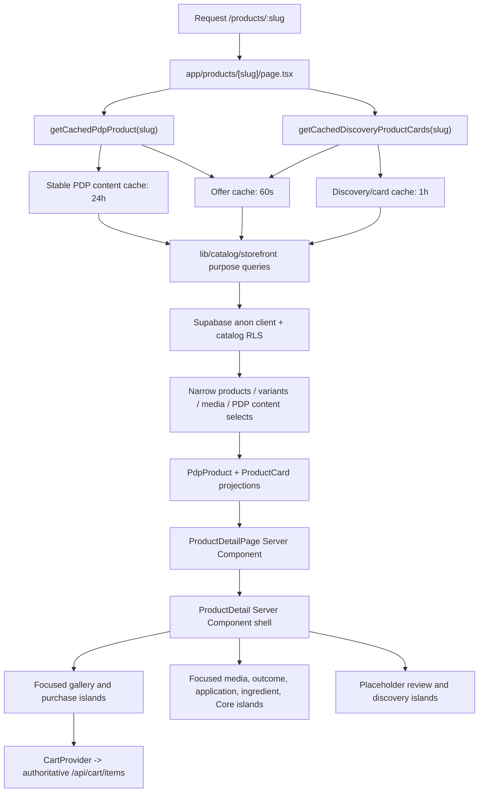

# Mei Pelle PDP data flow

Verified against repository code and the linked non-production Supabase project
`erasogmsqpgiirovubjh` on 2026-07-30, including the completed Phase 2 catalog
schema prune.

## Executive summary

- **Canonical source:** Supabase `public.products`,
  `public.product_variants`, `public.product_media`, and relationship tables are
  authoritative for the public catalog. There is no static runtime product
  fallback.
- **Runtime source:** `app/products/[slug]/page.tsx` composes narrow cached PDP
  content and offer projections through `lib/catalog-cache.ts`;
  `lib/catalog/storefront.ts` queries Supabase with the anon client under
  catalog RLS. Discovery, metadata, routes, cards, ingredient index, and Core
  routine use their own purpose-specific projections.
- **Cache layer:** Next `unstable_cache` separates stable content (24 hours),
  offers (60 seconds), and card/discovery membership (one hour), with granular
  domain and product tags. The authenticated catalog webhook receiver
  revalidates affected tags and paths.
- **Search layer:** Algolia is a derived product-discovery index built from a
  separate Supabase source query. It is not read by the PDP.
- **Presentation-content layer:** focused repository files provide layout
  structure, design tokens, interaction labels, and placeholder review
  fixtures. They do not replace product-specific Supabase content, price,
  variants, inventory, profile facts, or canonical media.
- **Media layer:** public product media is stored in the project-controlled
  `mei-pelle-catalog` Supabase Storage bucket. `product_media` records provide
  role, type, URL, dimensions, alt text, and ordering to the catalog query.
- **Rendering layer:** `ProductDetail` is a Server Component shell. Gallery,
  shared purchase controls, accordions, routine media, outcomes, application,
  ingredients, Core details, reviews, and discovery are focused client islands.

The route currently emits metadata through `generateMetadata`, but no Product
JSON-LD or other product structured-data generator exists in the inspected
route or shared components.

## Read-path diagram



### Route details

- `generateStaticParams()` calls `getCachedProductRoutes()` and emits only the
  route projection available at generation time.
- `generateMetadata()` calls `getCachedProductMetadata(slug)` and uses
  `seoTitle ?? formalTitle` plus `seoDescription ?? cardTagline`.
- The page calls `notFound()` only when the canonical product query returns no
  row. Query/configuration errors are not converted into a false 404.
- `getCachedDiscoveryProductCards()` runs independently after the primary
  product is resolved; Core summaries are fetched only for Core PDPs.
- `stripeMessagingPublishableKey()` provides only the public key passed to
  `AfterpayMessaging`; it does not affect catalog resolution.

## Product-field matrix

In the table:

- `PDP_PRODUCT_SELECT` is the focused content query in
  `lib/catalog/storefront.ts`; offer fields use `PRODUCT_OFFER_SELECT`.
- `SOURCE_SELECT` is the Algolia source query in `lib/algolia/source.ts`.
- Product page content and offer cache independently with product-specific
  content/offer tags.
- "Direct edit" means a privileged operator can edit the verified
  non-production row; browser roles remain read-only under RLS.

### PDP content authority

| Field | Previous Supabase source | Previous TypeScript source | Previous precedence | Final canonical owner | Migration/backfill |
| --- | --- | --- | --- | --- | --- |
| Titles, subtitles, descriptions, merchandising copy | First-class `products` columns | Generic rendering only | Supabase with documented same-row fallbacks | Existing `products` columns | None; populated values preserved |
| Structured how-to steps | `editorial_how_to_use` / `how_to_use` paragraphs | `productPdpContentBySlug.howToUseSteps` | TypeScript steps replaced the paragraph when the slug matched | `product_pdp_content.how_to_use_steps`; existing paragraph remains its Supabase fallback | Six approved step arrays |
| Core profile and routine-video copy | None | `corePdpPresentationBySlug` | TypeScript only | `product_pdp_content.profile_title_tokens` and `routine_overlay` | CLEANSE, TREAT, SEAL |
| Outcomes | `products.benefits` supplied supporting facts | Slug-keyed heading and labels; hues in the same object | TypeScript heading/labels | Heading and labels in `product_pdp_content`; step-keyed hues remain TypeScript design tokens | CLEANSE, TREAT, SEAL |
| Application instructions | `editorial_how_to_use` / `how_to_use` paragraphs | `corePdpPresentationBySlug.applicationSteps` | TypeScript carousel steps | `product_pdp_content.application_steps`; hues remain TypeScript design tokens | CLEANSE, TREAT, SEAL |
| Ingredient cards and narrative | `products.key_ingredients` and full INCI | `productPdpContentBySlug` cards/story | TypeScript structured copy | `product_pdp_content.ingredient_cards` and `ingredient_story` | Cards for six products; stories for the three Core products |
| Routine placement | First-class `products.routine_*` columns | `productRoutinePresentationBySlug` | Supabase when populated, otherwise slug fallback | Existing `products.routine_*` columns | None; slug fallback removed |
| Details/routine guidance | None | `PDP_CORE_DETAILS_PRESENTATIONS.routineFit` | TypeScript only | `product_pdp_content.routine_guidance` | CLEANSE, TREAT, SEAL |
| Product media associations | `product_media` | Role-aware layout configuration | Supabase associations | Existing `product_media` table | None |
| Placeholder reviews | None | `lib/catalog/product-reviews.ts` | TypeScript fixture | TypeScript fixture, intentionally unchanged | Excluded |

| Field | Database/source location | Query and mapping precedence | Runtime consumer | Cache and tag | Algolia | Direct edit | Repository writer risk |
| --- | --- | --- | --- | --- | --- | --- | --- |
| Display name | `products.display_name` | Canonical purpose-specific projection; no legacy fallback | PDP H1, sticky bar, cart snapshot, reviews/discovery labels | Stable content / `catalog-product-content:<slug>` | Yes: `title`, `displayName` | Yes | Preserved by default; presentation recovery requires `--overwrite-editorial` |
| Formal title | `products.formal_title` | Canonical purpose-specific projection; no legacy fallback | Metadata title fallback | Stable content / `catalog-product-content:<slug>` | Yes | Yes | Preserved by default; presentation recovery requires `--overwrite-editorial` |
| Card tagline | `products.card_tagline` | Canonical purpose-specific projection; no legacy fallback | Hero tagline, metadata description fallback, discovery | Content/card domains with product tags | Yes | Yes | Preserved by default; explicit editorial recovery only |
| Description | `editorial_description` | Canonical purpose-specific projection; no legacy fallback | Hero description and deeper fallback copy | Stable content / `catalog-product-content:<slug>` | Yes | Yes | Canonical editorial value is preserved by default |
| Price | `product_variants.price_cents` | Narrow offer projection; variants sorted by `sort_order`; client selects one variant | Hero price, add button, sticky bar, Afterpay amount | Offer cache, 60 seconds / `catalog-product-offer:<slug>` | Yes: min/max derived from variants | Yes | Supplier import can overwrite |
| Currency | `products.currency` exists | Selected, but `mapRow` currently normalizes every value to `USD` | Hero formatting, Afterpay, cart/checkout | Product page / `product:<slug>` | Hard-coded `USD` | Yes, but non-USD is ignored | Import can overwrite |
| Variants | `product_variants` joined rows | `PRODUCT_SELECT`; `mapRow` maps key, label, price, SKU, options, volume, pack count, ordering | Variant controls, availability, cart add | Product page / `product:<slug>` | Names/count/price/availability | Yes | Supplier import can overwrite |
| Availability | `products.status`, `catalog_status`; variant `available`, `inventory_status` | `mapRow` validates enums; `ProductDetail` requires active available product and usable variant | Status text, disabled/waitlist/add paths | Product page / `product:<slug>` | Yes | Yes | Supplier import updates sellable/inventory state but preserves publication status |
| Routine fields | `routine_group`, `routine_step_number`, `routine_step_name`, `routine_sort` | Narrow projections; display/group labels derive from these fields | Group label, sticky bar, discovery order, Core classification and FYI | Stable content/card/Core domains and granular tags | Yes | Yes | Catalog import preserves canonical routine fields |
| `good_for` | `products.good_for` | `PRODUCT_SELECT`; direct `mapRow` | Core profile and Beyond Quick Signals | Product page / `product:<slug>` | Yes and keyword input | Yes | Preserved by default; supplier recovery requires `--overwrite-editorial` |
| `texture` | `products.texture` | `PRODUCT_SELECT`; direct `mapRow` | Core `FEELS LIKE`, Beyond Quick Signals, details | Product page / `product:<slug>` | Yes and keyword input | Yes | Supplier import can overwrite |
| `finish` | `products.finish` | `PRODUCT_SELECT`; direct `mapRow` | Core `FINISH`, Beyond Quick Signals, details | Product page / `product:<slug>` | No | Yes | Supplier import can overwrite |
| `skin_types` | `products.skin_types` | `PRODUCT_SELECT`; array mapped directly | Core FYI and details | Product page / `product:<slug>` | No | Yes | Supplier import can overwrite |
| `usage_time` | `products.usage_time` | `PRODUCT_SELECT`; array mapped directly | Core FYI, Beyond Quick Signals, details | Product page / `product:<slug>` | Keyword input | Yes | Supplier import can overwrite |
| Benefits | `products.benefits` | `PRODUCT_SELECT`; array mapped directly | Supporting body for lower "What it does" sequence | Product page / `product:<slug>` | No | Yes | Preserved by default; supplier recovery requires `--overwrite-editorial` |
| Ingredients | `products.ingredients` | Canonical PDP projection; no JSON or TypeScript fallback | Core in-place full ingredients disclosure and Beyond disclosure | Stable content / `catalog-product-content:<slug>` | Split into search ingredient terms | Yes | Supplier import writes the canonical field and preserves source provenance separately |
| Key ingredients | `products.key_ingredients` | `PRODUCT_SELECT`; array mapped directly | Purchase accordion and lower ingredient content fallback | Product page / `product:<slug>` | Yes: terms/keywords | Yes | Supplier import can overwrite |
| How to use | `editorial_how_to_use`; structured `product_pdp_content.how_to_use_steps` and `application_steps` | Structured content is used when present; otherwise the canonical editorial paragraph is parsed. Intentional empty arrays remain empty | Purchase accordion, Core application carousel, and Beyond lower use sequence | Stable content / `catalog-product-content:<slug>` | Not displayed in record | Yes | Canonical paragraph and structured steps are preserved by default |
| SEO | `products.seo_title`, `seo_description` | `PRODUCT_SELECT`; mapped directly; route fallbacks described above | `generateMetadata` | Product page / `product:<slug>` | No | Yes | Presentation seed or explicit editorial recovery only |
| Media | `product_media` plus Storage URLs | Role-filtered purpose projections map `media_type`, URL/palette payload, role, and order | Gallery, hero/card/cart/search media, Core video/profile | Content/card domains with role-aware invalidation | Only approved image roles | Yes | Dedicated media syncs; import/refresh preserve existing associations unless explicitly confirmed |
| Discovery products | narrow card projection plus `product_relationships` membership | Fetches only the three displayed cards, excluding the current product | `ProductDiscoveryRail` | One hour; discovery/card/product tags | Not read from Algolia | Yes | Same catalog writers |
| Reviews | `lib/catalog/product-reviews.ts` fixture | `getProductReviews(slug)` default prop in `ProductDetail` | `ProductReviewsSection` | Bundled repository code, outside catalog tags | No | No | Repository-only fixture |
| Structured PDP editorial content | `product_pdp_content` one-to-one product row | `normalizeProductPdpContent()` validates schema version 1; no slug fallback | Profile title, video overlay, outcome copy, application, ingredient cards/story, details routine guidance | Product page / `product:<slug>` through the joined catalog read | No | Yes | Additive migration backfills six rows; browser roles are read-only |
| Core outcome/application hues and media focal positions | Stable Core-step tokens in `lib/content/core-pdp.ts` | Supabase copy is combined with step-keyed visual tokens only when required content validates | `PdpProfileSplit`, `PdpOutcomeSplit`, `PdpApplicationCarousel`, `PdpIngredientsSplit` | Bundled design configuration | No | No | Repository-only non-content presentation |
| Core routine module | Active `routine_group = core` rows plus one `core_routine_texture` and optional `core_routine_editorial` media row per product | `getCoreRoutineProducts()` requires exactly CLEANSE, TREAT, and SEAL in three-step Core order; System product numbers remain 01/03/05 | `PdpCoreRoutineSection` after DETAILS on Core PDPs | One hour; `catalog:core-routine` plus all three product tags | No; dedicated media is explicitly excluded | Yes | Core PDP media sync owns both dedicated roles |

### Final compatibility boundary

- Public runtime and current writers no longer select, map, or serialize
  `product_details`, the legacy precedence shadows, or superseded routine
  labels/order fields. Those columns have been removed from the final schema.
- Verified `sourceFullInci` values are backfilled into `products.ingredients`
  and the full original source-shaped product object remains retained once in
  `product_sources.raw_source.catalogProduct`.
- Active drafts and all new revisions must be V2. Only immutable historical V1
  revisions pass through the retained database V1→V2 restoration adapter; no
  storefront or active-draft compatibility fallback remains.
- `lib/catalog/product-routine.ts` contains generic label and sort helpers only.
  It does not infer product-specific values from slugs.
- `lib/catalog/product-content.ts` contains schema-versioned runtime validation
  and normalization only. It contains no product-specific copy.

## Media flow

```text
Explicitly named user source
  -> inspect codec/dimensions/orientation/duration
  -> retain compliant MP4 or generate true WebP derivative
  -> SHA-256 content hash
  -> versioned Supabase Storage object
  -> canonical product_media row
  -> PRODUCT_SELECT join
  -> mapRow role/type mapping
  -> PdpRoutineVideo / PdpProfileSplit / PdpIngredientsSplit /
     PdpCoreRoutineSection / ProductImage
  -> product-specific cache/path revalidation
```

### Current media model

`public.product_media` contains product and optional variant foreign keys,
`media_type`, nullable URL, alt text, dimensions, role, sort order, source
metadata, placeholder palette metadata, and timestamps. The redundant
`media_kind` column and unused `campaign` role were removed in Phase 2. It has:

- unique `(product_id, role, sort_order)`
- partial unique `(product_id, role)` for dedicated Core PDP editorial roles
- product/sort, role/sort, and an optional variant index
- RLS allowing anon/authenticated reads only through an active, published parent
  product
- no public write policy
- an `updated_at` trigger

Migration `20260724075058_core_pdp_editorial_media.sql` added the first three editorial
roles. Follow-up migration
`20260724091004_tighten_core_pdp_editorial_media.sql` makes intrinsic
dimensions non-null for those roles and enforces one canonical row per product
and dedicated role. Migration
`20260724100802_add_ingredients_texture_media_role.sql` added
`ingredients_texture`, requires it to be a concrete image with dimensions, and
adds a one-row-per-product partial unique index:

- `routine_video` requires `media_type = 'video'`
- `routine_video_poster`, `profile_editorial`, and `ingredients_texture` require
  `media_type = 'image'`
- all four require the canonical `media_type`, a non-empty URL, and positive
  dimensions

Concrete versus placeholder state is derived from URL and
`placeholder_palette`; `media_type` alone distinguishes image from video.

### Media roles and consumers

| Role | Current consumer/meaning | Allowed to become hero/card/cart/search media |
| --- | --- | --- |
| `card_default`, `card` | Primary product card fallback | Yes, by explicit precedence |
| `card_hover` | Product card hover state | Card hover only |
| `detail` | Preferred PDP hero/detail image and gallery item | Yes |
| `hero` | PDP hero fallback and gallery item | Yes |
| `gallery` | PDP gallery item | Gallery only |
| `cart` | Cart thumbnail override | Cart only |
| `search` | Algolia/search thumbnail override | Search only |
| `pdp_application` | Three ordered Core PDP application states | Never |
| `pdp_outcome` | Three ordered Core PDP outcome states | Never |
| `routine_video` | Foreground and synchronized blurred-background video | Never |
| `routine_video_poster` | Paused foreground poster and blurred poster fallback | Never |
| `profile_editorial` | Core product-profile right panel | Never |
| `ingredients_texture` | Core formula-texture image in the ingredient split | Never |
| `core_routine_texture` | Interactive three-step Core routine texture state | Never |
| `core_routine_editorial` | Optional large image in the shared Core routine visual panel | Never |

`lib/catalog.ts`, `lib/cart/server.ts`, and `lib/algolia/record.ts` each use an
explicit allowlist so the new roles cannot win merely through a lower
`sort_order`.

### Core media preparation and delivery

All source videos were inspected as portrait 720 x 1280, 30 fps H.264 MP4 with
AAC mono audio at 22.05 kHz and no rotation. They were already suitable delivery
assets, so no video transcode or crop was performed. The delivery bytes equal
the supplied source bytes.

| Product | Duration | Video bytes / bitrate | Poster frame | Profile preparation |
| --- | --- | --- | --- | --- |
| CLEANSE | 41.934 s | 5,433,719; video 965,525 bps, audio 64,252 bps | 18 s | Supplied PNG payload converted to true WebP |
| TREAT | 35.034 s | 4,266,903; video 903,175 bps, audio 64,316 bps | 20 s | Supplied PNG payload converted to true WebP |
| SEAL | 35.934 s | 6,157,997; video 1,299,769 bps, audio 64,348 bps | 29 s | Supplied PNG payload converted to true WebP |

Representative posters were generated without baked controls or overlay text.
The largest video is 5.87 MiB, so the current sync uses the standard Storage API
upload. Supabase recommends TUS resumable upload for files that may exceed
6 MB; future assets crossing that boundary should use the direct Storage
hostname and TUS. See the official
[standard upload](https://supabase.com/docs/guides/storage/uploads/standard-uploads)
and
[resumable upload](https://supabase.com/docs/guides/storage/uploads/resumable-uploads)
guides.

The sync uses `cacheControl: 31536000`, `upsert: false`, verified MIME types, and
content-addressed paths. This follows Supabase guidance to publish changed
assets at new paths rather than overwrite CDN-cached bytes; see
[Smart CDN](https://supabase.com/docs/guides/storage/cdn/smart-cdn).

| Slug / role | SHA-256 and versioned object path |
| --- | --- |
| CLEANSE video | `11445f51b162d579d71c2767a5c66bcdafbe419e1bc644ec0c5508cc6bc86a10` at `products/cleanse-01-calming-gel-cleanser/routine/<hash>.mp4` |
| CLEANSE poster | `645ef158ba34d19ee56e755e595d7101b875c28d8ee3ae90fbf271c8f4c8a1c9` at `products/cleanse-01-calming-gel-cleanser/routine/<hash>.webp` |
| CLEANSE profile | `4608d57d7ee6905436841330e4564bbecd156449c1b3f966bc093464e0c04838` at `products/cleanse-01-calming-gel-cleanser/profile/<hash>.webp` |
| CLEANSE ingredient texture | `823eeecca862cd4486b54d6020eccb8c033506970377d8a22fa590ac42279189` at `products/cleanse-01-calming-gel-cleanser/ingredients-texture/<hash>.webp` |
| TREAT video | `53d8fe1459545df281be847bf5e529e510c56628325f0796b89c45abde367578` at `products/treat-03-pdrn-5-ampoule/routine/<hash>.mp4` |
| TREAT poster | `5c70d8d414087b4a73332af3012c039816c5731ca1072f4fcb5962216ecfc95a` at `products/treat-03-pdrn-5-ampoule/routine/<hash>.webp` |
| TREAT profile | `36c9cf8396fa5ae455d6f43c1439141737d6c27323002997bd675ff789307f72` at `products/treat-03-pdrn-5-ampoule/profile/<hash>.webp` |
| TREAT ingredient texture | `0f22a937ec1a96fe4d715a332a14c3136b6e1fb5b8fd2d3833421e5626c7f424` at `products/treat-03-pdrn-5-ampoule/ingredients-texture/<hash>.webp` |
| SEAL video | `a0da3538cce18a4fe5e693f2a43d831635ced4e966dddb6c67c853f2c488db56` at `products/seal-05-green-collagen-cream/routine/<hash>.mp4` |
| SEAL poster | `bed952d83845a0379d4143e0e253c627c5711571fca91ee8412e8e580bf795d5` at `products/seal-05-green-collagen-cream/routine/<hash>.webp` |
| SEAL profile | `540b1c0ed218a6e81a99f925fb3972252c1e357ea7a3592e9e80008bbf263c4e` at `products/seal-05-green-collagen-cream/profile/<hash>.webp` |
| SEAL ingredient texture | `73ea87cb38df7d48d35b479dbebda47de9851250eeefd49ae3b6c08251412d88` at `products/seal-05-green-collagen-cream/ingredients-texture/<hash>.webp` |
| CLEANSE Core routine texture | `91b8b6ca613de06eadaf78a55a9e399518d5d23a3bbb04f60bf7f9ccea04bd53` at `products/cleanse-01-calming-gel-cleanser/core-routine-texture/<hash>.webp` |
| TREAT Core routine texture | `737d7617f514569d918e49b091631da888af9c46cb7b46deed117d14519e5011` at `products/treat-03-pdrn-5-ampoule/core-routine-texture/<hash>.webp` |
| SEAL Core routine texture | `e5e0f6b7d8f4404bf98e61e377450169edcc45d68fd5f04b761bd2bdad312631` at `products/seal-05-green-collagen-cream/core-routine-texture/<hash>.webp` |
| CLEANSE Core routine editorial | Pending `cleanse-pdp-core-routine-editorial-01.webp` at `products/cleanse-01-calming-gel-cleanser/core-routine-editorial/<hash>.webp` |
| TREAT Core routine editorial | Pending `treat-pdp-core-routine-editorial-01.webp` at `products/treat-03-pdrn-5-ampoule/core-routine-editorial/<hash>.webp` |
| SEAL Core routine editorial | Pending `seal-pdp-core-routine-editorial-01.webp` at `products/seal-05-green-collagen-cream/core-routine-editorial/<hash>.webp` |

The supplied CLEANSE routine texture was explicitly named
`cleanse-pdp-routine-texture-01.webp`; it was mapped by its CLEANSE product
prefix and normalized to the required canonical
`cleanse-pdp-core-routine-texture-01.webp` basename. CLEANSE and TREAT carried
PNG payloads despite their source extensions and were converted to true WebP.
The supplied SEAL file was already a valid WebP and its bytes were retained.

The one-off Core PDP media migration was removed after its canonical Storage
objects and `product_media` rows were verified. Future media changes use the
protected catalog editor or a reviewed one-time migration.

### Outcome media preparation and delivery

Outcome images use one shared runtime role, `pdp_outcome`, with numeric
`sort_order` values 1 through 3. Product association comes from the canonical
source basename (`cleanse-pdp-outcomes-01.webp` or
`treat-pdp-outcomes-01.webp`), never from outcome-label wording, file arrival
order, or runtime filename parsing. The storefront consumes the ordered
`product_media` rows directly and retains its existing geometric fallback when
no qualifying rows exist.

The supplied TREAT files were PNG payloads despite their `.webp` extensions.
They were decoded and converted losslessly to true WebP without cropping,
stretching, upscaling, recoloring, or introducing orientation metadata. The
sync stores the canonical source basenames in `source_filename`, uploads new
bytes to immutable content-addressed paths under
`products/<slug>/outcomes/<sha256>.webp`, and uses `upsert: false`. Existing
CLEANSE object bytes, URLs, row identities, dimensions, alt text, and ordering
remain unchanged; only their legacy `outcome-0N.webp` provenance names are
normalized to `cleanse-pdp-outcomes-0N.webp`.

The outcome-media ingestion script was removed after all six canonical
associations were verified. Runtime authority remains Supabase Storage and
`product_media`.

## Cache and revalidation

### Time-based cache

Public catalog cache domains have independent fallback lifetimes so an offer
change does not evict stable editorial content:

| Domain | Fallback lifetime | Representative tag |
| --- | ---: | --- |
| PDP/editorial content and metadata | 86,400 seconds | `catalog-product-content:<slug>` |
| Offers, variants, and availability | 60 seconds | `catalog-product-offer:<slug>` |
| Product cards | 3,600 seconds | `catalog-product-card:<slug>` |
| Discovery and collection membership | 3,600 seconds | `catalog-discovery`, `collection:<slug>` |
| Core routine content | 86,400 seconds | `catalog-core-routine` |

PDP, product-card, metadata, route, ingredient-index, discovery, and Core reads
use purpose-specific Supabase projections. The PDP composes cached content and
offer fragments after verifying that their product identities match. `/system`
is the remaining compatibility consumer of the broad editorial `Product`
shape, but its stable, offer, and card fragments still have separate policies.

### Webhook receiver

`POST /api/webhooks/supabase/catalog-search-sync`:

- requires `x-webhook-secret` and uses constant-time comparison
- caps declared request size at 64,000 bytes
- accepts only public-schema INSERT/UPDATE/DELETE events for `products`,
  `product_variants`, `product_media`, and `product_pdp_content`
- re-fetches the current canonical parent before deciding the Algolia action
- invalidates catalog tags and routes after processing
- still attempts cache invalidation and returns a retryable 502 if Algolia fails

Normal product/variant/listing-media changes invalidate global catalog/listing
tags, `/`, `/products`, affected PDP paths, relevant collections, and the
sitemap for product events.

Editorial-only media events do not evict listing caches. The shared
`core_routine_texture` and `core_routine_editorial` invalidate
`catalog:core-routine` and all three Core PDP tags and paths; other editorial
roles invalidate only the affected product tag and PDP path. Both roles resolve
the parent product and skip Algolia writes.

### Verified automatic-delivery status

The remote non-production schema has no Database Webhook or HTTP trigger on
`products`, `product_variants`, `product_media`, or `product_pdp_content`; only
normal timestamp triggers were present. Database Webhooks were not enabled, and
no stable deployed receiver endpoint was available.
Therefore automatic webhook delivery is **not active** and must not be claimed.

Provisioning a database webhook against the stable deployed receiver remains an
external deployment action. The source-controlled provisioning command injects
the secret from the operator environment and never records its value in source
or command output. A complete missed-event recovery uses the generic
`search:reindex` flow rather than replaying product-media rows.

## Algolia flow

```text
Supabase products + variants + product_media
  -> lib/algolia/source.ts SOURCE_SELECT
  -> buildAlgoliaRecord()
  -> stable objectID = products.id
  -> algoliasearch write client
  -> search-only product document
```

- **Source query:** `fetchSearchRecordById()` rebuilds one record;
  `fetchAllSearchRecords()` reads every active product for recovery/backfill.
- **Mapper:** `buildAlgoliaRecord()` derives title, product facts, variant price
  range, availability, keywords, ranking, swatch, and one approved image.
- **Object ID:** stable Supabase product UUID, not slug.
- **Indexed image:** only `search`, `card_default`, `card`, `detail`, or `hero`
  concrete non-video media can win, in that precedence order.
- **Update path:** product events and relevant variant/media events re-fetch and
  upsert the parent record.
- **Delete path:** product DELETE removes the stable object ID; missing or
  unpublished parents found during dependent-row processing are also deleted.
- **Full reconciliation:** protected `/api/admin/search-reindex` and
  `scripts/search-backfill.ts` rebuild the complete active index.
- **Editorial media:** the parent is resolved for cache targeting, but
  `routine_video`, `routine_video_poster`, `profile_editorial`,
  `ingredients_texture`, `core_routine_texture`, and
  `core_routine_editorial` return a no-op before any Algolia write.

The initial Core-media delivery was checked against live non-production Algolia
records. All three passed: the established search image URLs remained unchanged
and no video, poster or profile URL became a search thumbnail.

Algolia is not the PDP source because the product route never imports an
Algolia client. A search outage can degrade search while a cached or reachable
Supabase catalog continues to render PDPs.

## Cart and checkout flow

```text
Selected Product + variant in ProductDetail
  -> CartProvider POSTs slug, variantId, quantity
  -> addCartItem validates canonical product/variant
  -> server-backed carts/cart_items
  -> readCheckoutCart re-joins current product/variant price and availability
  -> immutable pending order + order_items snapshots
  -> sandbox Stripe Checkout line items
  -> signed Stripe webhook finalizes payment state
```

- The browser-visible name, price, availability, image, subtotal, user ID, and
  discount are not trusted for cart or checkout authority.
- `addCartItem()` accepts only slug, variant key, and normalized quantity, then
  resolves an active, available product and variant server-side.
- Cart reads join current `price_cents` and availability. Cart image selection
  permits only `cart`, `card_default`, and `card` non-video roles.
- `getCheckoutCartSnapshot()` re-reads the server cart and maps a product
  snapshot containing product/variant identity, price, swatch, and utility
  media.
- `insertOrderSnapshot()` stores integer-cent order totals and independent
  `order_items` with unit price, quantity, subtotal, and `product_snapshot`.
- Rewards, referral discounts, shipping qualification, and Stripe line items
  are resolved server-side. Stripe remains sandbox-gated.
- Success redirects do not finalize payment; the signed Stripe webhook does.

## Static and repository-owned PDP content

| File | Runtime role | Classification |
| --- | --- | --- |
| `lib/content/core-pdp.ts` | Stable Core-step identifiers, outcome/application hues, and focal positions; combines them with validated Supabase copy | Presentation-only and intentional |
| `lib/catalog/product-content.ts` | Schema-versioned validation and normalization for `product_pdp_content` | Canonical accessor; contains no product-specific copy |
| `lib/catalog/product-ingredients.ts` | Strict full-INCI precedence and compatibility validation | Canonical-field resolver; contains no ingredient list |
| `lib/catalog/product-routine.ts` | Generic routine label/sort helpers over the mapped product row | Presentation helper; contains no product-specific map |
| `lib/catalog/product-reviews.ts` | Slug-keyed early response cards | Repository fixture, not canonical customer review data |
| `lib/content/product-endorsements.ts` | Local endorsement media still used on Beyond The Core PDPs | Presentation-only; removed from Core composition |

## New modules from this task

| Visible element | Exact source |
| --- | --- |
| Routine video | Supabase Storage URL from the product's canonical `product_media` row with role `routine_video` |
| Routine poster | Supabase Storage URL from role `routine_video_poster` |
| Profile image | Supabase Storage URL from role `profile_editorial`; only the explicit `-01` basename was ingested |
| Profile title | `product_pdp_content.profile_title_tokens`; TypeScript supplies layout only |
| `GOOD FOR` | `Product.goodFor` mapped from `products.good_for` |
| `FEELS LIKE` | `Product.texture` mapped from `products.texture` |
| `FINISH` | `Product.finish` mapped from `products.finish` |
| `FYI` | Composed from `skin_types`, `usage_time`, `routine_step_number`, and `routine_group_label` |
| Outcome heading/labels | `product_pdp_content.outcome_heading` and `outcome_labels`; canonical `benefits` is unchanged |
| Outcome hue slides | Three decorative color configurations per Core slug in `lib/content/core-pdp.ts` |
| Application steps and hue states | Instructions from `product_pdp_content.application_steps`; stable visual step IDs and hues in TypeScript |
| Ingredient story | Structured `product_pdp_content.ingredient_story`, runtime-validated without a static product fallback |
| Ingredient texture | Supabase Storage URL from role `ingredients_texture`; exact user basename maps one image to each Core product |
| Core routine selector | Exactly three active Core product rows ordered by canonical routine metadata |
| Core routine textures | Supabase Storage URLs from role `core_routine_texture`; one explicit canonical basename per Core product |
| Core routine editorial images | Optional Supabase Storage URLs from role `core_routine_editorial`; when absent, the matching product's canonical swatch hue remains visible |
| Core routine hues | Each product's canonical `swatch_from` and `swatch_to` values |
| Full INCI | `products.ingredients` only |

Core modules fail closed as a connected presentation:

- video renders only with both a valid video and poster row
- profile and outcome render only with the Core presentation and a valid
  profile image row
- application and ingredient story follow outcome only for Core; missing
  ingredient media reports temporary unavailability instead of substituting
  another image
- the full-list button is omitted when no verified canonical list resolves
- the routine module renders only when the dedicated query returns exactly
  CLEANSE, TREAT, and SEAL with complete metadata and media
- no empty frame is shown
- Beyond The Core retains the endorsement rail and Quick Signals

The video uses one uncropped `object-fit: contain` foreground with native
controls and a pointer-inert, muted synchronized background. Before activation,
only the blurred poster background is used. The background video starts after
the foreground plays and re-syncs on play, seek, time drift above 0.18 seconds,
rate change, pause, and end.

The outcome component keeps one contiguous three-slide vertical track and
transforms it by one slide height. Buttons expose `aria-pressed`; a single
semantic label is paired with an `aria-hidden` filled duplicate. Transform and
clip-path transitions use 1.5 seconds. Reduced motion reduces both to 0.001
seconds.

The application component renders three persistent copy and visual layers,
selects step 01 by default, and exposes three `aria-pressed` swatches plus one
cyclic right-arrow control. It has no interval or autoplay path. Incoming copy
translates from `(24px, 24px)` while outgoing copy translates to
`(-24px, -24px)` over 560 ms; reduced motion shortens animations to 1 ms.

The ingredient component keeps the image node mounted while the left panel
crossfades between story and disclosure states over 220 ms. The close button
and Escape return focus to the outlined image-panel trigger.

The Core routine component starts on the current PDP product and keeps all
three texture states mounted. Hover, focus, click/touch, Arrow keys, Home, and
End select a persistent state without navigation or autoplay. Copy and texture
layers transition directionally over 640 ms; reduced motion shortens them to
1 ms. The right texture field is decorative, while the bottom control is a
keyboard-operable radio group.

## Failure behavior

| Failure | Current behavior |
| --- | --- |
| Unknown slug | `getProduct()` returns `undefined`; route calls `notFound()` |
| Missing Supabase configuration | `SupabaseConfigError` fails fast and names missing environment variables; no static product is substituted |
| Supabase query unavailable | Catalog function throws a contextual error; stale cache may continue only while Next can serve it |
| Missing Core media row | Connected module is omitted; another product's media is never substituted |
| Video Storage/decode failure | Poster remains, status announces temporary unavailability, and Retry reloads both video elements |
| Unsupported video/decode path | Poster-backed unavailable state remains visible, fallback text is present in the video element, and Retry never substitutes another asset |
| Profile Storage response fails after a valid row loaded | Next Image reports the asset failure; there is not yet a dedicated profile retry UI |
| Missing ingredient-texture row | The Core story remains available and the image panel announces temporary media unavailability |
| Missing or incomplete Core routine query | The shared routine module is omitted and the rest of the PDP remains available |
| Missing or unverified full INCI | The `FULL INGREDIENTS LIST` button is omitted; no empty or fabricated disclosure is exposed |
| Stale catalog cache | Offers refresh within 60 seconds; stable PDP content refreshes within 24 hours; either can refresh sooner through granular tag/path invalidation |
| Webhook auth/validation failure | Receiver returns 401/400/413 and performs no mutation |
| Algolia write failure | Receiver attempts catalog invalidation, logs safe error text, and returns retryable 502 |
| Cache invalidation failure | Receiver returns retryable 502 with the search outcome |
| Algolia unavailable to shoppers | Search degrades independently; PDP reads remain Supabase/Next based |

### Caption status

All three videos contain an AAC audio track. No verified transcript or reliable
local speech-recognition result was available, so spoken instructional content
could not be confirmed or captioned accurately. No WebVTT track was fabricated.
A human-verified transcript, or confirmation that the audio is music-only, is a
remaining accessibility dependency before caption compliance can be claimed.

## Risks and recommendations

1. **Keep automatic database webhooks reconciled.** The four managed hooks for
   `products`, `product_variants`, `product_media`, and `product_pdp_content`
   target the stable authenticated receiver. Retain the plan/verify commands as
   drift detection and recovery.
2. **Resolve Storage listing exposure.** The Supabase advisor reports a broad
   public-bucket listing policy. Public object reads are required, but public
   listing should be narrowed separately without disrupting delivery URLs.
3. **Keep writer authority explicit.** The shared field-ownership manifest,
   default dry runs, and dedicated editorial confirmation must remain in place
   as editor capabilities expand.
4. **Add duration/poster relationships if media grows.** The current table has
   no video duration column or explicit poster foreign key; the role pair is
   resolved by product.
5. **Keep catalog selection allowlists synchronized.** PDP, cart, and Algolia
   each correctly exclude editorial roles from utility images, but every new
   role must be reviewed in all three places.
6. **Keep PDP islands focused.** `ProductDetail` is a Server Component shell.
   Gallery, purchase, accordion, media, outcome, application, Core, review, and
   discovery interactions remain isolated client boundaries and should receive
   only the serializable props they need.
7. **Add product structured data.** Metadata exists, but the route currently
   emits no Product JSON-LD.
8. **Improve profile-media recovery.** A valid row with an unavailable object
    does not have the video module's explicit retry treatment.
9. **Regenerate types after schema changes.** `pnpm run db:types` generates
    `lib/database.types.ts` from the linked approved project; compare the
    generated output before committing it.
10. **Complete the caption audit.** Verify each audio track with a human
    transcript or confirm it is non-speech before launch.

Raw source videos are not committed. Supabase Storage and `product_media` are
the runtime delivery authorities. Use the protected editor for associations and
the generic webhook verification or `search:reindex` flow for derived-state
recovery.
